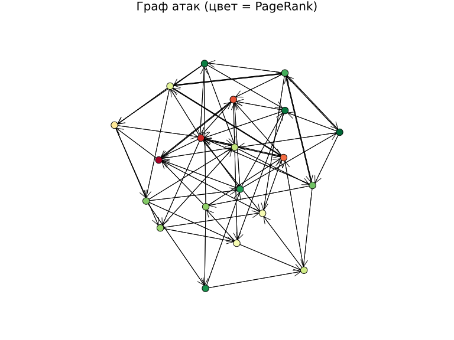
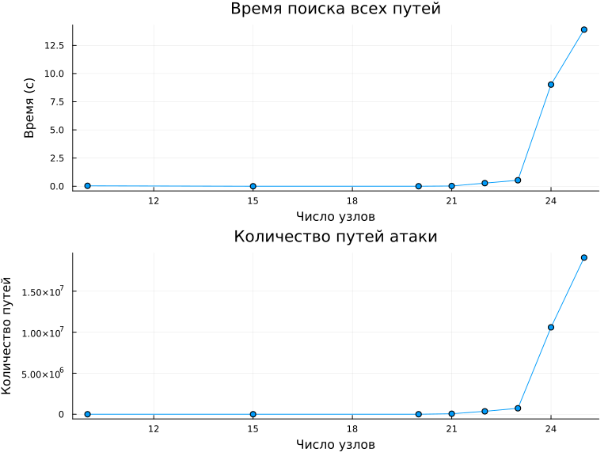
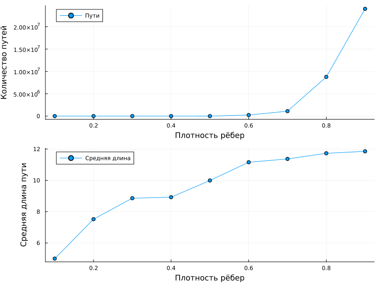

---
author:
  name: Andrew Grytskiv
  email: andreosf6846@gmail.com
title: "Отчёт по лабораторной работе №3"
subtitle: "Моделирование графов атак"
license: "CC BY"
---

# Цель работы

Освоить методы построения и анализа графов атак для оценки уязвимостей сетевой инфраструктуры. Изучить представление сетевой топологии в виде ориентированного графа, алгоритмы поиска путей атаки, расчёт метрик центральности и оценку вероятности успешной атаки.

# Задание

1. Построить граф атак для заданной топологии сети.
2. Реализовать алгоритм поиска всех путей от заданного источника к цели.
3. Рассчитать метрики центральности для всех узлов.
4. Визуализировать граф с цветовой индикацией уровня риска.
5. Вычислить наиболее вероятный путь атаки с учётом весов рёбер.

# Теоретическое введение

Граф атак — ориентированный граф, в котором вершины представляют состояния системы, а рёбра — действия атакующего. Для анализа используются метрики центральности: степень центральности, центральность по посредничеству, PageRank.

Вероятность успешной атаки по пути вычисляется как произведение вероятностей рёбер:

$$P_{path} = \prod_{e \in path} P(e)$$

# Выполнение лабораторной работы

## Построение графа атак

Реализована функция build_attack_graph в файле src/attack_graph.jl. Граф содержит 20 узлов с вероятностью случайного ребра 0.2 и доверительными отношениями между узлами.

## Визуализация графа

{#fig-001 width=90%}

## Исследование масштабируемости

{#fig-002 width=70%}

## Параметрическое исследование

{#fig-003 width=70%}






# Выводы

В ходе лабораторной работы освоены методы построения и анализа графов атак. Реализованы алгоритмы поиска всех путей (DFS) и наиболее вероятного пути (Дейкстра). Рассчитаны метрики центральности. Параметрическое исследование показало зависимость числа путей атаки от плотности рёбер графа.

# Список литературы{.unnumbered}

::: {#refs}
:::
